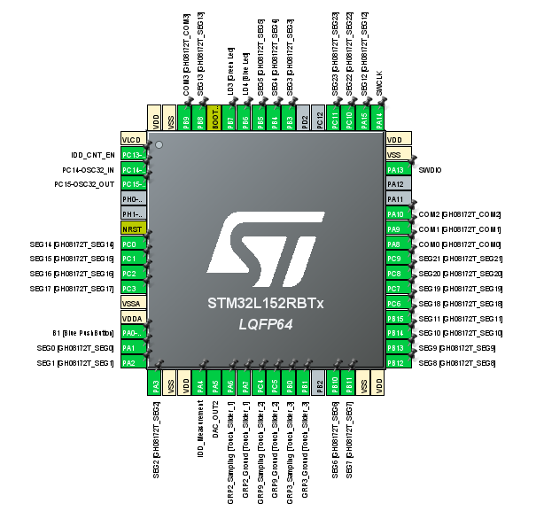
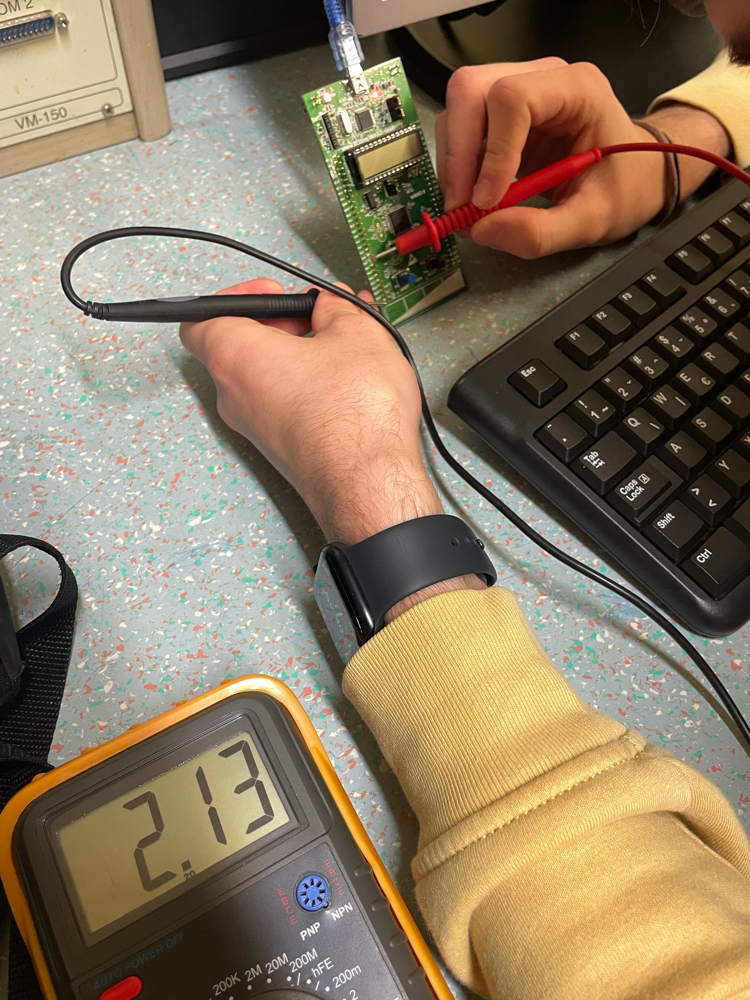

# DACpretvorba STM32L152CDiscovery

## Cilj naloge:
S pomočjo STM32CubeIDE inHAL knjižnicamisprogramirajte mikroprocesor tako, da bo izvedel digitalno  analogno  pretvorbo  (DAC).  Na  izhod  boste  nastavili  poljubno  napetost,  ki  jo  boste  izmerili  z  V-metrom. 

## Postopekinicializacije periferije
- 2
- od 0V do 3.3V
- **PA5**
- **Output Buffer:** Enable , **Trigger:** None. 
- odstopanje je **70mV**

# Piniout

# Slika delovanja

# Komentar
Koda na začetku ni delovala. Problem je bil odpravljen z zamenjavo razvojne plošče, saj je na začetku bila napačno izbrana.